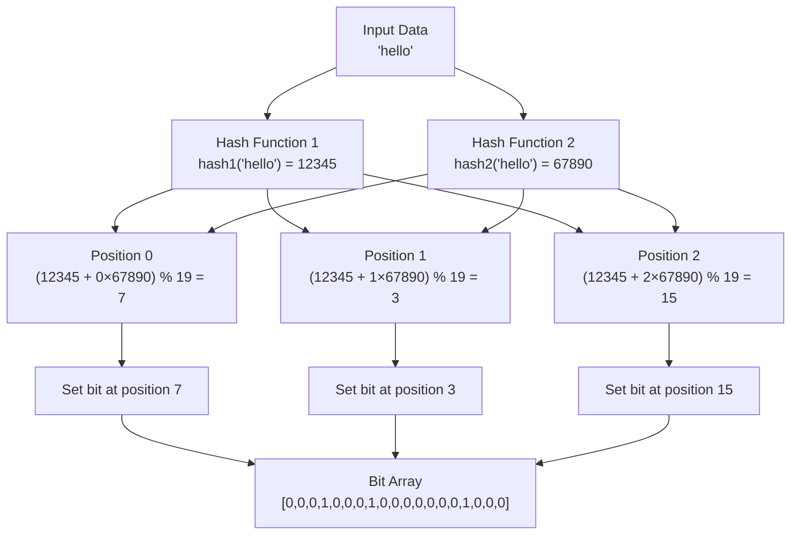
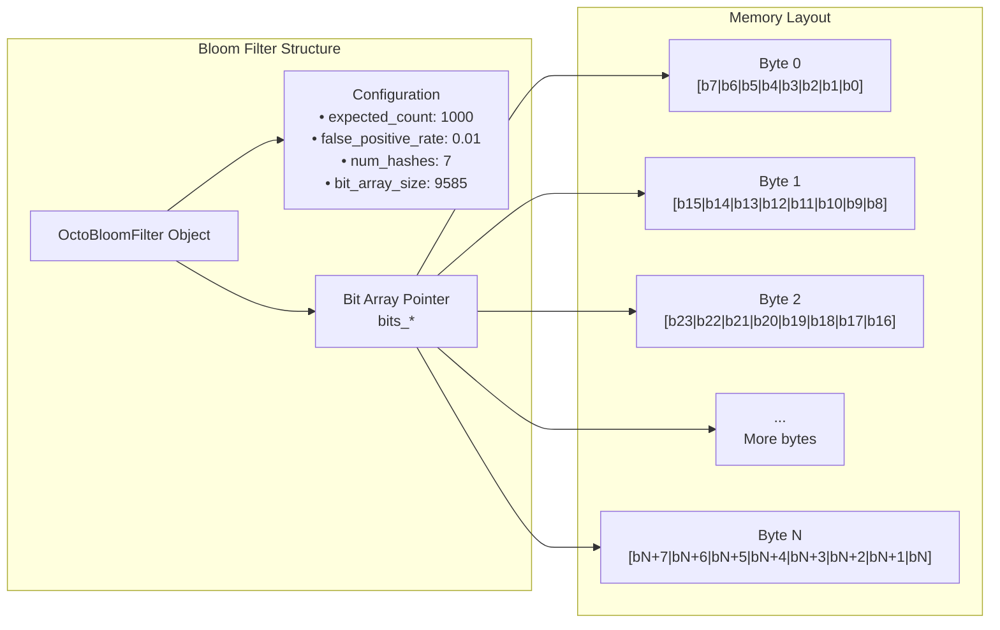
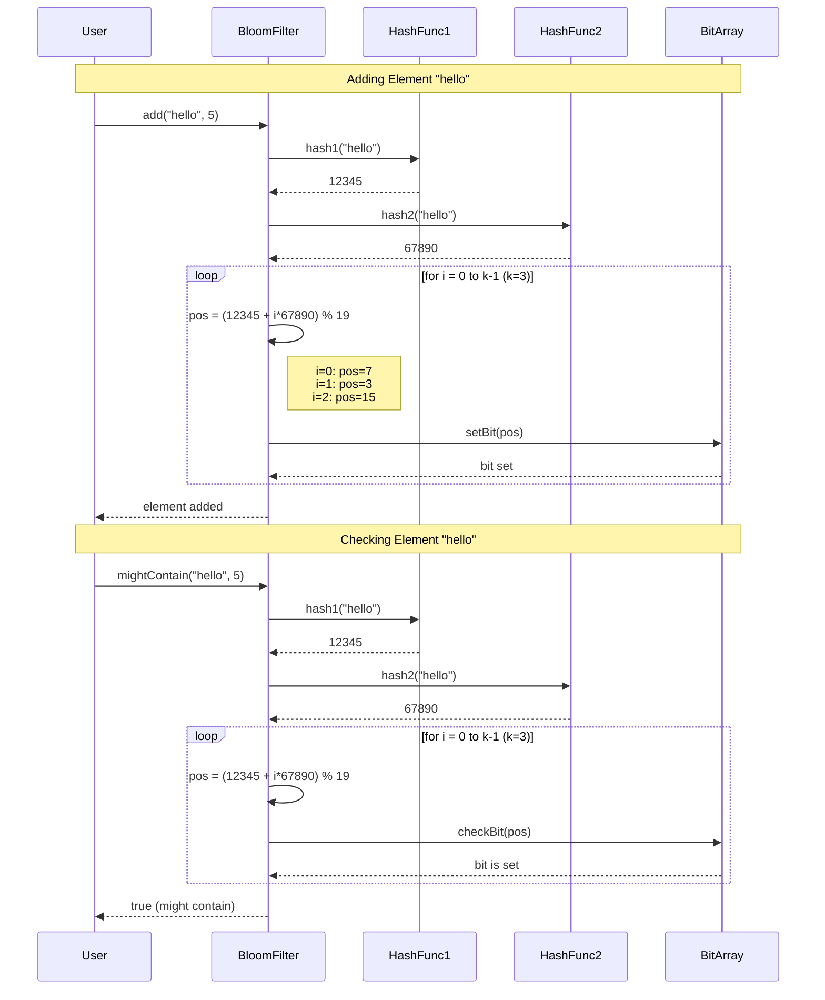
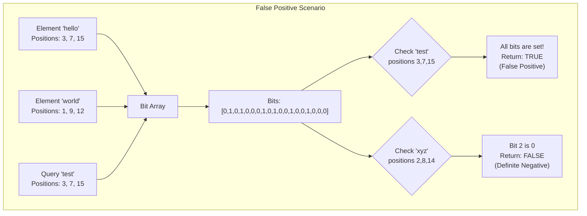

# OctoBloom Filter: Comprehensive Algorithm Documentation

## Table of Contents
1. [Introduction](#introduction)
2. [Mathematical Foundation](#mathematical-foundation)
3. [Algorithm Overview](#algorithm-overview)
4. [Data Structure Representation](#data-structure-representation)
5. [Implementation Details](#implementation-details)
6. [Working Examples](#working-examples)
7. [Performance Analysis](#performance-analysis)
8. [Use Cases in PostgreSQL](#use-cases-in-postgresql)

## Introduction

A Bloom filter is a space-efficient probabilistic data structure designed to test whether an element is a member of a set. It can have false positives but never false negatives - if it says an element is not in the set, it's definitely not there. If it says an element might be in the set, it could be a false positive.

### Key Properties
- **Space Efficient**: Uses a fixed-size bit array regardless of the number of elements
- **Fast Operations**: O(k) time complexity for both insertion and lookup, where k is the number of hash functions
- **Probabilistic**: Allows false positives but never false negatives
- **No Deletions**: Standard Bloom filters don't support element removal (though counting variants do)

## Mathematical Foundation

### Optimal Parameters Calculation

The OctoBloom filter automatically calculates optimal parameters based on:
- **Expected number of elements (n)**: The anticipated number of items to be inserted
- **Desired false positive rate (p)**: The acceptable probability of false positives

#### Bit Array Size (m)
The optimal size of the bit array is calculated using:

```
m = -(n × ln(p)) / (ln(2))²
```

Where:
- `m` = number of bits in the array
- `n` = expected number of elements
- `p` = desired false positive probability
- `ln` = natural logarithm

#### Number of Hash Functions (k)
The optimal number of hash functions is:

```
k = (m/n) × ln(2)
```

This formula minimizes the false positive rate for the given bit array size and expected elements.

#### Actual False Positive Rate
After inserting `n` elements, the actual false positive probability is:

```
p_actual = (1 - e^(-kn/m))^k
```

### Example Calculation

For `n = 1000` elements and desired `p = 0.01` (1% false positive rate):

```
m = -(1000 × ln(0.01)) / (ln(2))² ≈ 9585 bits
k = (9585/1000) × ln(2) ≈ 7 hash functions
```

## Algorithm Overview

### Core Operations

#### 1. Initialization
```cpp
OctoBloomFilter(uint64_t expected_count, double false_positive_rate)
```
- Calculate optimal bit array size and number of hash functions
- Allocate and zero-initialize bit array
- Set up hash function parameters

#### 2. Element Addition
```cpp
void add(const void* data, size_t length)
```
1. Generate k hash values using double hashing
2. Set corresponding bits in the array to 1
3. Never overwrite existing 1s (idempotent operation)

#### 3. Membership Test
```cpp
bool mightContain(const void* data, size_t length)
```
1. Generate k hash values using the same hash functions
2. Check if all corresponding bits are set to 1
3. Return false if any bit is 0 (definite negative)
4. Return true if all bits are 1 (possible positive)

## Data Structure Representation

### Memory Layout

```
OctoBloomFilter Object:
┌─────────────────────────────────────────────────────────────┐
│                    Object Header                            │
├─────────────────────────────────────────────────────────────┤
│ bits_: uint8_t*           │ Pointer to bit array           │
│ num_hashes_: uint32_t     │ Number of hash functions       │
│ expected_count_: uint64_t │ Expected number of elements    │
│ false_positive_rate_: double │ Target false positive rate │
│ bit_array_size_: size_t   │ Size in bits                   │
│ byte_array_size_: size_t  │ Size in bytes                  │
└─────────────────────────────────────────────────────────────┘
                    │
                    ▼
┌─────────────────────────────────────────────────────────────┐
│                    Bit Array (bits_)                       │
│ [byte0][byte1][byte2]...[byteN]                            │
│ Each byte contains 8 bits: b7 b6 b5 b4 b3 b2 b1 b0        │
└─────────────────────────────────────────────────────────────┘
```

### Bit Array Organization

The bit array is organized as an array of bytes, where each bit represents a potential element position:

```
Byte Index:    0      1      2      3    ...
Bit Indices: 0-7    8-15   16-23  24-31  ...

Byte 0: [b7][b6][b5][b4][b3][b2][b1][b0]
         7   6   5   4   3   2   1   0   <- Bit positions

To set bit at index i:
- byte_index = i / 8
- bit_position = i % 8
- bit_mask = 1 << bit_position
- bits_[byte_index] |= bit_mask
```

## Implementation Details

### Double Hashing Technique

OctoBloom uses double hashing to generate k independent hash values from just two hash functions:

```cpp
hash_i = (hash1 + i × hash2) % bit_array_size
```

Where `i` ranges from 0 to k-1.

#### Hash Functions Used

1. **Primary Hash (hash1)**: Uses PostgreSQL's `hash_any` function
   - Optimized for database operations
   - Falls back to simple DJB2-style hash if needed

2. **Secondary Hash (hash2)**: Custom FNV-style hash
   - Different seed and algorithm to ensure independence
   - Uses FNV prime multiplication for good distribution

```cpp
// Primary hash (DJB2 variant)
uint64_t hash = 5381;
for (size_t i = 0; i < length; ++i) {
    hash = ((hash << 5) + hash) + bytes[i]; // hash * 33 + c
}

// Secondary hash (FNV variant)
uint64_t hash = 0x9e3779b97f4a7c15; // Different seed
for (size_t i = 0; i < length; ++i) {
    hash ^= bytes[i];
    hash *= 0x100000001b3; // FNV prime
    hash ^= (hash >> 32);
}
```

### Bit Manipulation Operations

#### Setting a Bit
```cpp
size_t byte_index = index / 8;
uint8_t bit_mask = 1 << (index % 8);
bits_[byte_index] |= bit_mask;
```

#### Checking a Bit
```cpp
size_t byte_index = index / 8;
uint8_t bit_mask = 1 << (index % 8);
bool is_set = (bits_[byte_index] & bit_mask) != 0;
```

## Visual Representations

### Hash Function Flow
The following diagram shows how double hashing generates multiple bit positions from two hash functions:



### Memory Structure
This diagram illustrates how the Bloom filter is organized in memory:



### Operation Sequence
This sequence diagram shows the step-by-step process of adding and querying elements:



### False Positive Illustration
This diagram demonstrates how false positives can occur:



## Working Examples

### Example 1: Small Filter with Manual Calculation

Let's create a small Bloom filter for demonstration:
- Expected elements: n = 4
- Desired false positive rate: p = 0.1 (10%)

**Parameter Calculation:**
```
m = -(4 × ln(0.1)) / (ln(2))² ≈ 19 bits
k = (19/4) × ln(2) ≈ 3 hash functions
```

**Bit Array Visualization (19 bits = 3 bytes):**
```
Initial state (all zeros):
Byte 0: [0][0][0][0][0][0][0][0]  (bits 0-7)
Byte 1: [0][0][0][0][0][0][0][0]  (bits 8-15)
Byte 2: [0][0][0][x][x][x][x][x]  (bits 16-18, x = unused)
```

### Example 2: Adding Elements

Let's add the string "hello" to our filter:

**Step 1: Generate hash values**
```cpp
// Assume our hash functions produce:
hash1("hello") = 12345
hash2("hello") = 67890

// Generate k=3 hash positions:
pos0 = (12345 + 0 × 67890) % 19 = 12345 % 19 = 7
pos1 = (12345 + 1 × 67890) % 19 = 80235 % 19 = 3
pos2 = (12345 + 2 × 67890) % 19 = 148125 % 19 = 15
```

**Step 2: Set bits at positions 7, 3, and 15**
```
After adding "hello":
Byte 0: [1][0][0][0][1][0][0][0]  (bit 7 and 3 set)
         7 6 5 4 3 2 1 0
Byte 1: [1][0][0][0][0][0][0][0]  (bit 15 set)
         15 14 13 12 11 10 9 8
Byte 2: [0][0][0][x][x][x][x][x]  (no bits set in this range)
```

### Example 3: Membership Testing

**Testing "hello" (should return true):**
- Calculate same hash positions: 7, 3, 15
- Check if all bits are set: bits[7]=1, bits[3]=1, bits[15]=1
- Result: `true` (might contain)

**Testing "world" (assume it hashes to positions 2, 9, 16):**
- Check bits: bits[2]=0, bits[9]=0, bits[16]=0
- Since bit 2 is 0, we know "world" is definitely not in the set
- Result: `false` (definitely not present)

### Example 4: False Positive Scenario

**Testing "goodbye" (assume it hashes to positions 7, 3, 15):**
- These are the same positions as "hello"!
- Check bits: bits[7]=1, bits[3]=1, bits[15]=1
- All bits are set, but "goodbye" was never added
- Result: `true` (false positive)

This demonstrates how false positives can occur when different elements hash to the same bit positions.

### Example 5: Real-World PostgreSQL Usage

Let's see how the OctoBloom filter works in a PostgreSQL environment:

**Setup:**
```sql
-- Create a table with user emails
CREATE TABLE users (
    id SERIAL PRIMARY KEY,
    email VARCHAR(255) UNIQUE,
    created_at TIMESTAMP DEFAULT NOW()
);

-- Insert sample data
INSERT INTO users (email) VALUES 
    ('alice@example.com'),
    ('bob@example.com'),
    ('charlie@example.com');

-- Initialize Bloom filter for the email column
-- Expected 100,000 users with 1% false positive rate
SELECT octo_bloom_init('users'::regclass, 'email', 100000, 0.01);
```

**Calculated Parameters:**
- Bit array size: m = -(100000 × ln(0.01)) / (ln(2))² ≈ 958,506 bits (≈ 117 KB)
- Number of hash functions: k = (958506/100000) × ln(2) ≈ 7 functions

**Query Examples:**
```sql
-- Fast membership test (no disk I/O if result is false)
SELECT octo_bloom_might_contain('users'::regclass, 'email', 'alice@example.com');
-- Returns: true (might exist)

SELECT octo_bloom_might_contain('users'::regclass, 'email', 'nonexistent@example.com');
-- Returns: false (definitely doesn't exist)

-- Complete existence check with verification
SELECT octo_bloom_exists('users'::regclass, 'email', 'alice@example.com');
-- Returns: true (exists and verified)
```

### Example 6: Performance Comparison

**Without Bloom Filter:**
```sql
-- Traditional query - always hits disk
SELECT COUNT(*) FROM users WHERE email = 'nonexistent@example.com';
-- Time: ~10ms (with index), ~100ms (without index)
```

**With Bloom Filter:**
```sql
-- Bloom filter pre-check
SELECT CASE 
    WHEN NOT octo_bloom_might_contain('users'::regclass, 'email', 'nonexistent@example.com')
    THEN 0  -- Fast path: definitely not present
    ELSE (SELECT COUNT(*) FROM users WHERE email = 'nonexistent@example.com')
END;
-- Time: ~0.1ms (for non-existent values)
```

**Performance Metrics:**
- Memory usage: 117 KB vs. several MB for hash index
- False positive rate: ~1% as configured
- Speed improvement: 100x faster for negative results

## Performance Analysis

### Time Complexity
- **Insertion**: O(k) where k is the number of hash functions
- **Lookup**: O(k) where k is the number of hash functions
- **Space**: O(m) where m is the bit array size

### Space Efficiency Comparison

For 1 million 32-byte strings:

| Data Structure | Memory Usage | Lookup Time |
|---------------|--------------|-------------|
| Hash Set | ~64 MB | O(1) average |
| Sorted Array | ~32 MB | O(log n) |
| **Bloom Filter** | **~1.2 MB** | **O(k) ≈ O(1)** |

### False Positive Rate Analysis

With optimal parameters, the false positive rate remains constant regardless of the number of elements inserted (up to the expected count):

```
Theoretical: p = (1 - e^(-kn/m))^k
With n=1000, m=9585, k=7: p ≈ 0.01 (1%)
```

## Use Cases in PostgreSQL

### 1. Query Optimization
```sql
-- Instead of expensive JOIN:
SELECT * FROM large_table l 
JOIN small_table s ON l.user_id = s.user_id;

-- Use Bloom filter pre-check:
SELECT * FROM large_table 
WHERE octo_bloom_might_contain('small_table_oid', 'user_id', user_id)
  AND EXISTS (SELECT 1 FROM small_table WHERE user_id = large_table.user_id);
```

### 2. Cache Warming
```sql
-- Pre-populate Bloom filter with frequently accessed values
SELECT octo_bloom_init('users'::regclass, 'email', 100000, 0.01);

-- Triggers automatically maintain the filter
SELECT octo_bloom_attach_triggers('users'::regclass, 'email');
```

### 3. Distributed Query Optimization
```sql
-- Check if value exists before expensive remote query
SELECT CASE 
  WHEN NOT octo_bloom_might_contain('remote_table_oid', 'key', $1)
  THEN false  -- Definitely not present
  ELSE octo_bloom_exists('remote_table_oid', 'key', $1)  -- Verify with actual query
END;
```

### Memory Management

The implementation uses PostgreSQL's memory management:
- `palloc()` for allocation (automatic cleanup on transaction end)
- Shared memory for persistence across sessions
- Serialization support for disk storage

### Thread Safety

The filter is designed for PostgreSQL's process model:
- Read operations are naturally thread-safe
- Write operations are protected by PostgreSQL's locking mechanisms
- Shared memory access is coordinated through standard PostgreSQL APIs

## Conclusion

The OctoBloom filter provides an efficient probabilistic data structure for membership testing in PostgreSQL environments. Its mathematical foundation ensures optimal performance characteristics, while the implementation leverages PostgreSQL's infrastructure for reliability and integration.

Key benefits:
- **Space Efficient**: Constant memory usage regardless of element size
- **Fast Operations**: O(1) average time complexity
- **PostgreSQL Integration**: Native support for database operations
- **Configurable**: Tunable false positive rates based on requirements
- **Reliable**: No false negatives, controlled false positive rate

The filter is particularly valuable for large-scale database operations where memory efficiency and query performance are critical considerations.
